# BTX Architecture — Annex A: Engineering Artefacts

> Companion to `BTX_Architecture_Document.md`. This annex turns architectural intent into reviewable engineering artefacts: sequence diagrams, state machines, ERDs, OpenAPI/AsyncAPI excerpts, Rego policy samples with tests, crypto profile and event catalogue.

## A.0 Contents

1. [Sequence diagrams](#a1-sequence-diagrams)
2. [State machines](#a2-state-machines)
3. [Entity-relationship model (control plane)](#a3-entity-relationship-model-control-plane)
4. [Control-plane OpenAPI (excerpt)](#a4-control-plane-openapi-excerpt)
5. [Trust Node wire contract](#a5-trust-node-wire-contract)
6. [PurposeGuard Rego policy + tests](#a6-purposeguard-rego-policy--tests)
7. [Event catalogue (AsyncAPI excerpt)](#a7-event-catalogue-asyncapi-excerpt)
8. [Cryptographic profile spec](#a8-cryptographic-profile-spec)
9. [Verifiable Credential status list design](#a9-verifiable-credential-status-list-design)
10. [Crypto agility & PQC migration plan](#a10-crypto-agility--pqc-migration-plan)
11. [Backwards compatibility & version skew matrix](#a11-backwards-compatibility--version-skew-matrix)

---

## A.1 Sequence diagrams

### A.1.1 Runtime exchange — happy path (yes/no verification)

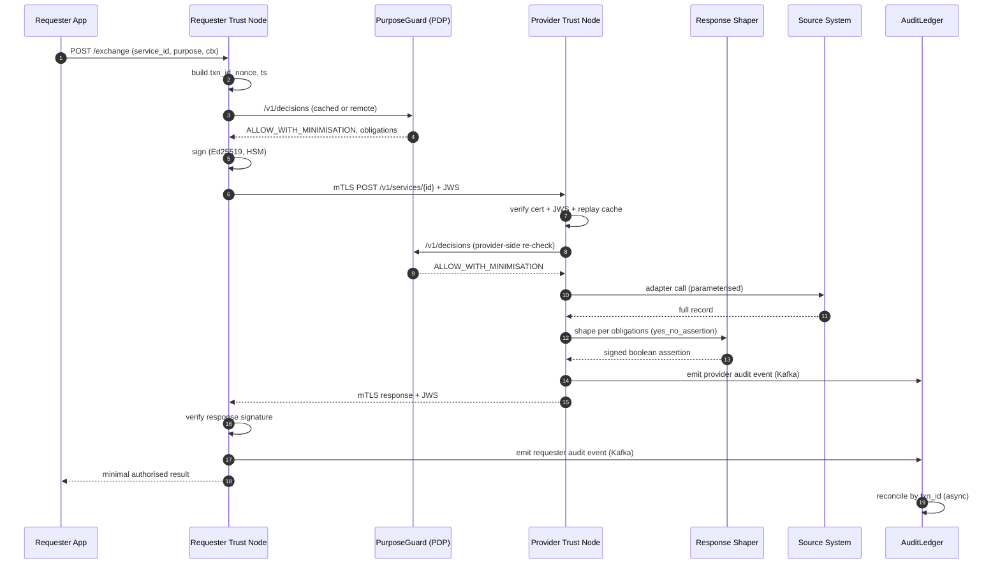

**Per-hop latency budget reconciliation (target p95 ≤ 300 ms for yes/no):**

| Step | Budget |
|---|---|
| 1-4 build + cache PDP | 15 ms |
| 5 sign | 5 ms |
| 6-8 mTLS + verify + replay | 25 ms |
| 9-10 provider PDP (cache) | 10 ms |
| 11-12 adapter + source | 100 ms |
| 13-14 shape + sign | 10 ms |
| 15-17 return + verify | 25 ms |
| 18-19 audit emit (async) | 0 ms (off path) |
| network RTT | 100 ms |
| headroom | 10 ms |
| **Total** | **300 ms** |

### A.1.2 Control-plane outage — signed config cache continuity

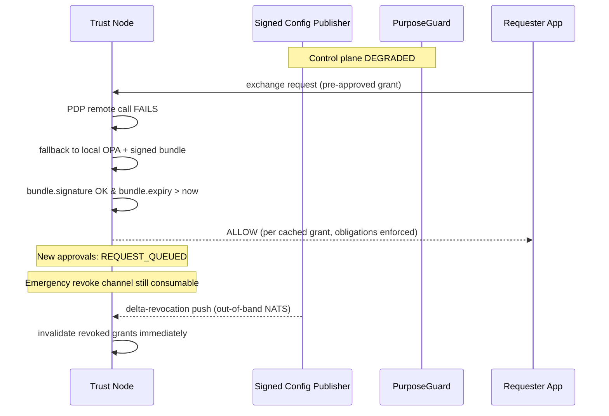

### A.1.3 Member onboarding (sandbox → production)

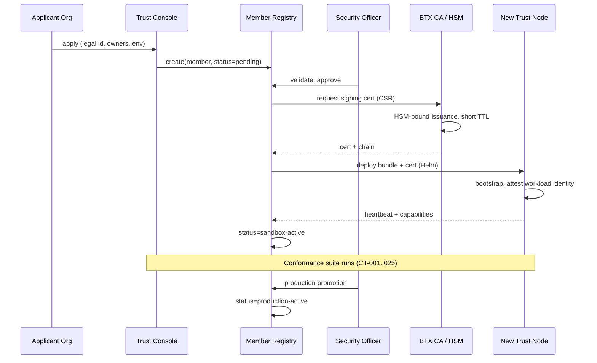

### A.1.4 Emergency revocation

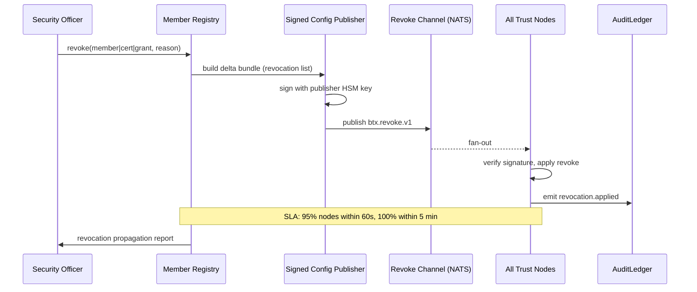

### A.1.5 Citizen grievance / correction

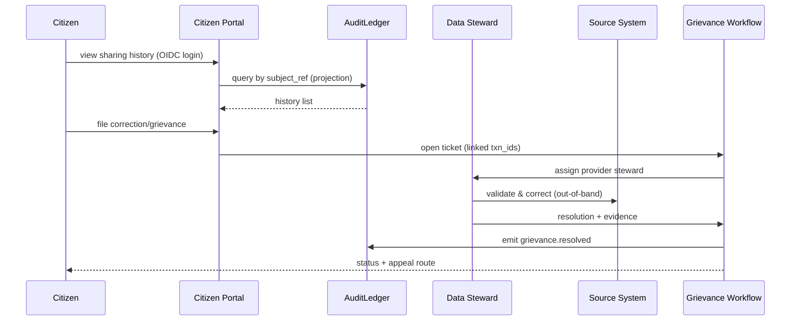

### A.1.6 DR failover (control plane region loss)

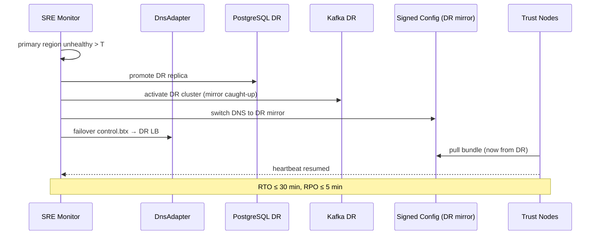

---

## A.2 State machines

### A.2.1 Member lifecycle

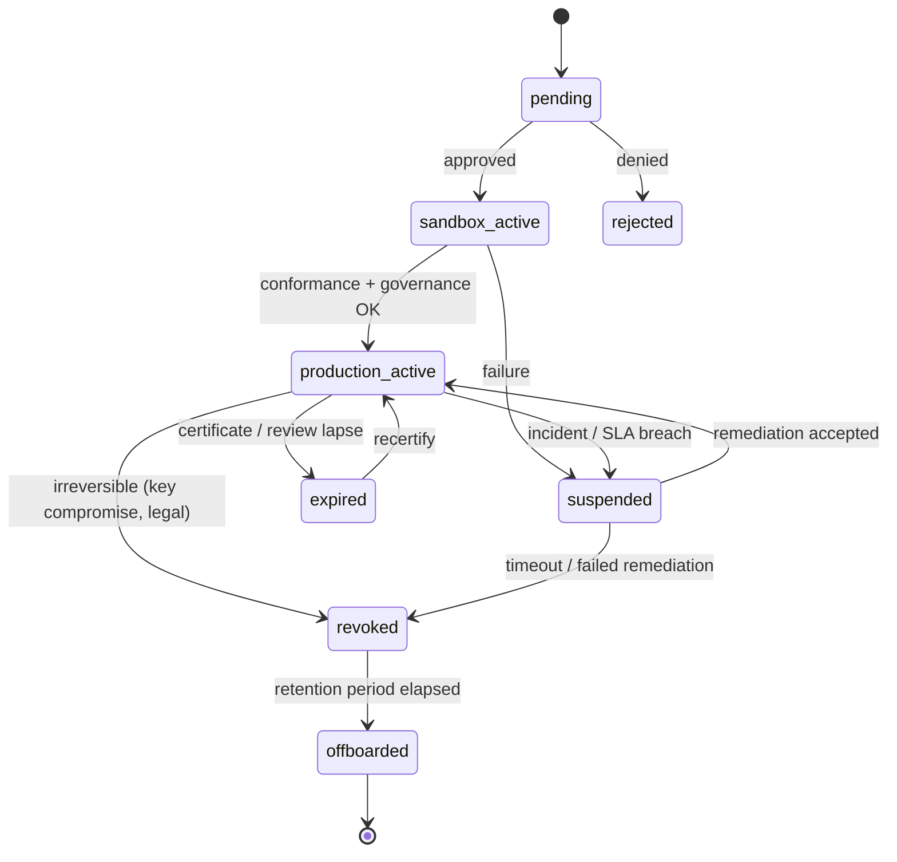

### A.2.2 Service lifecycle

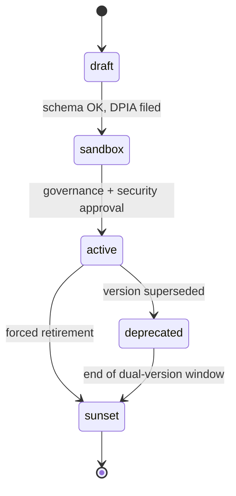

### A.2.3 Certificate lifecycle

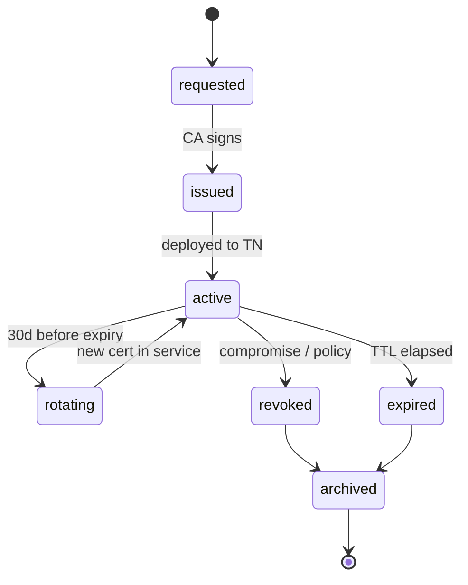

### A.2.4 Grant (access approval) lifecycle

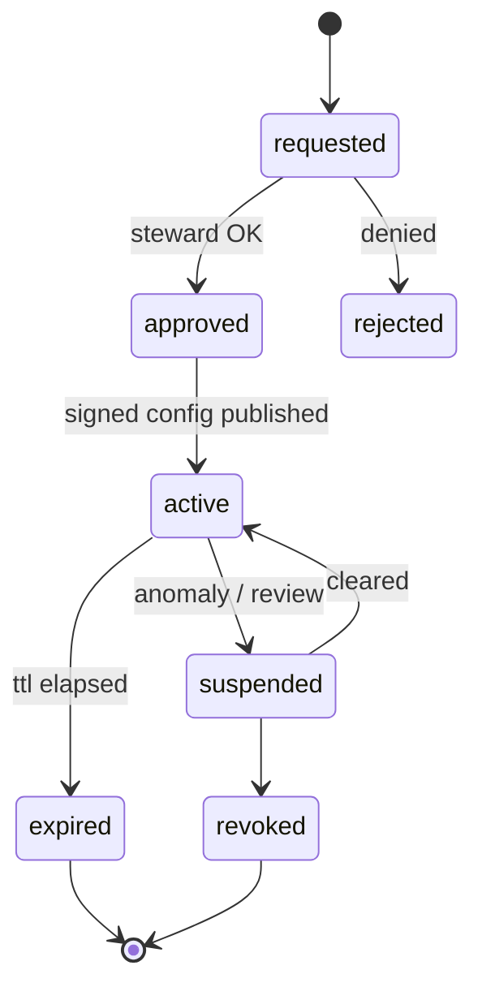

### A.2.5 Policy bundle lifecycle

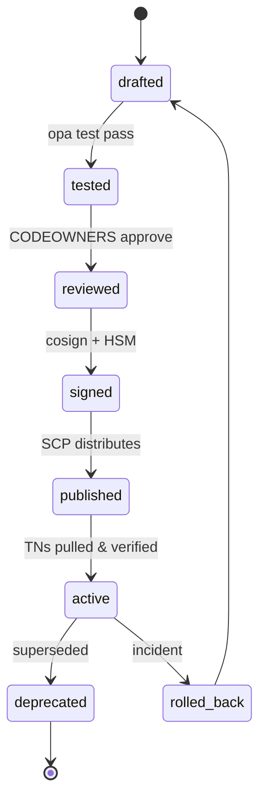

---

## A.3 Entity-relationship model (control plane)

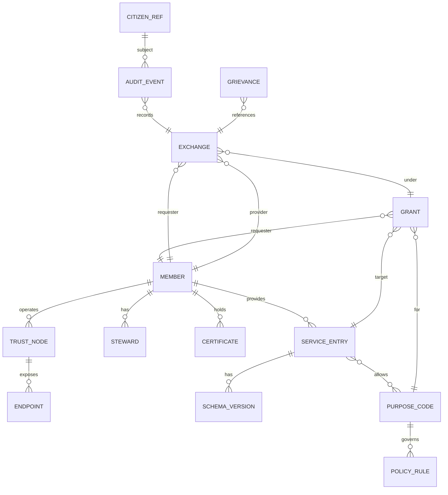

### A.3.1 Sample DDL (PostgreSQL, abridged)

```sql
CREATE TABLE member (
  member_id        text PRIMARY KEY,
  legal_name       text NOT NULL,
  member_code      text UNIQUE NOT NULL,
  role             text NOT NULL CHECK (role IN ('provider','requester','both')),
  status           text NOT NULL CHECK (status IN
                   ('pending','sandbox_active','production_active',
                    'suspended','expired','revoked','offboarded')),
  environment      text NOT NULL,
  steward_id       uuid REFERENCES steward(steward_id),
  created_at       timestamptz NOT NULL DEFAULT now(),
  updated_at       timestamptz NOT NULL DEFAULT now(),
  audit_lineage_id uuid NOT NULL
);

CREATE INDEX idx_member_status ON member(status);
CREATE INDEX idx_member_role   ON member(role);

CREATE TABLE service_entry (
  service_id        text PRIMARY KEY,
  provider_member   text NOT NULL REFERENCES member(member_id),
  version           text NOT NULL,
  type              text NOT NULL CHECK (type IN ('REST','SOAP','EVENT','DOC','VC')),
  data_class        text NOT NULL CHECK (data_class IN
                    ('open','operational','citizen_portable','restricted','non_shareable')),
  schema_ref        text NOT NULL,
  sla_class         text NOT NULL,
  lifecycle_state   text NOT NULL,
  created_at        timestamptz NOT NULL DEFAULT now()
);

CREATE TABLE service_purpose (
  service_id text REFERENCES service_entry(service_id),
  purpose_code text REFERENCES purpose_code(purpose_code),
  PRIMARY KEY (service_id, purpose_code)
);

CREATE TABLE grant_record (
  grant_id          uuid PRIMARY KEY,
  requester_member  text REFERENCES member(member_id),
  service_id        text REFERENCES service_entry(service_id),
  purpose_code      text REFERENCES purpose_code(purpose_code),
  scope             jsonb NOT NULL,
  obligations       jsonb NOT NULL,
  valid_from        timestamptz NOT NULL,
  valid_to          timestamptz NOT NULL,
  status            text NOT NULL,
  approver_id       uuid NOT NULL
);

CREATE INDEX idx_grant_lookup
  ON grant_record(requester_member, service_id, purpose_code, status, valid_to);

-- Audit events partitioned by month
CREATE TABLE audit_event (
  txn_id            uuid NOT NULL,
  source_role       text NOT NULL,
  event_ts          timestamptz NOT NULL,
  service_id        text NOT NULL,
  purpose_code      text NOT NULL,
  requester_member  text NOT NULL,
  provider_member   text NOT NULL,
  decision          text NOT NULL,
  response_shape    text,
  latency_ms        int,
  chain_prev_hash   bytea,
  chain_event_hash  bytea NOT NULL,
  payload           jsonb NOT NULL,
  PRIMARY KEY (txn_id, source_role, event_ts)
) PARTITION BY RANGE (event_ts);
```

---

## A.4 Control-plane OpenAPI (excerpt)

```yaml
openapi: 3.1.0
info:
  title: BTX Control Plane API
  version: 1.0.0
servers:
  - url: https://control.btx/api
security:
  - oidc: [btx.admin]
paths:
  /v1/members:
    post:
      summary: Register a new member (pending)
      requestBody:
        required: true
        content:
          application/json:
            schema: { $ref: '#/components/schemas/MemberCreate' }
      responses:
        '201':
          description: Created
          content:
            application/json:
              schema: { $ref: '#/components/schemas/Member' }
  /v1/members/{memberId}:
    get:
      parameters:
        - in: path
          name: memberId
          required: true
          schema: { type: string }
      responses:
        '200':
          content:
            application/json:
              schema: { $ref: '#/components/schemas/Member' }
    patch:
      summary: Update lifecycle (suspend/revoke/recertify)
      requestBody:
        required: true
        content:
          application/json:
            schema: { $ref: '#/components/schemas/MemberPatch' }
      responses: { '200': { description: Updated } }

  /v1/services:
    post:
      summary: Publish a service entry (sandbox)
      requestBody:
        required: true
        content:
          application/json:
            schema: { $ref: '#/components/schemas/ServiceCreate' }
      responses: { '201': { description: Created } }

  /v1/grants:
    post:
      summary: Request access grant
      requestBody:
        required: true
        content:
          application/json:
            schema: { $ref: '#/components/schemas/GrantRequest' }
      responses: { '202': { description: Pending approval } }

  /v1/decisions:
    post:
      summary: PurposeGuard PDP decision
      requestBody:
        required: true
        content:
          application/json:
            schema: { $ref: '#/components/schemas/DecisionRequest' }
      responses:
        '200':
          content:
            application/json:
              schema: { $ref: '#/components/schemas/DecisionResponse' }

components:
  securitySchemes:
    oidc:
      type: openIdConnect
      openIdConnectUrl: https://idp.btx/.well-known/openid-configuration
  schemas:
    Member:
      type: object
      required: [member_id, legal_name, role, status]
      properties:
        member_id: { type: string, pattern: '^[A-Z0-9-]{3,64}$' }
        legal_name: { type: string }
        role: { type: string, enum: [provider, requester, both] }
        status:
          type: string
          enum: [pending, sandbox_active, production_active, suspended, expired, revoked, offboarded]
        environment: { type: string, enum: [sandbox, staging, production] }
        nodes:
          type: array
          items: { $ref: '#/components/schemas/TrustNodeRef' }
    DecisionRequest:
      type: object
      required: [transaction_id, requester_member_id, provider_member_id,
                 service_id, purpose_code, data_class, environment]
      properties:
        transaction_id: { type: string, format: uuid }
        requester_member_id: { type: string }
        provider_member_id: { type: string }
        requester_node_id: { type: string }
        service_id: { type: string }
        purpose_code: { type: string }
        data_class: { type: string }
        citizen_context_ref: { type: string, nullable: true }
        lawful_basis_ref: { type: string, nullable: true }
        consent_ref: { type: string, nullable: true }
        requested_fields: { type: array, items: { type: string } }
        environment: { type: string }
        risk_context:
          type: object
          properties:
            channel: { type: string }
            bulk: { type: boolean }
            volume_estimate: { type: integer, minimum: 0 }
    DecisionResponse:
      type: object
      required: [decision, policy_version, obligations, reason_codes]
      properties:
        decision:
          type: string
          enum: [ALLOW, ALLOW_WITH_MINIMISATION, ALLOW_WITH_NOTICE,
                 REQUIRE_CONSENT, ESCALATE, DENY]
        policy_version: { type: string }
        allowed_fields: { type: array, items: { type: string } }
        response_shape:
          type: string
          enum: [full, masked, yes_no_assertion, signed_claim, selective_disclosure]
        retention:
          type: object
          properties:
            requester_cache_ttl: { type: string }
            audit_retention: { type: string }
        obligations: { type: array, items: { type: string } }
        reason_codes: { type: array, items: { type: string } }
```

---

## A.5 Trust Node wire contract

### A.5.1 Request headers (mandatory)

| Header | Format | Notes |
|---|---|---|
| `x-btx-version` | `1` | Protocol major |
| `x-btx-txn-id` | UUIDv4 | Unique per logical exchange |
| `x-btx-member-id` | string | Requester member |
| `x-btx-node-id` | string | Requester TN ID |
| `x-btx-service-id` | string | Target service |
| `x-btx-purpose-code` | string | Must exist in Purpose Registry |
| `x-btx-data-class` | enum | open/operational/citizen_portable/restricted |
| `x-btx-timestamp` | RFC 3339 UTC | TTL ≤ 60s |
| `x-btx-nonce` | base64(16 bytes) | Anti-replay |
| `x-btx-bundle-version` | string | Echoed by provider |
| `x-btx-trace-id` | W3C traceparent | OTel |
| `x-btx-signature` | JWS detached | Signs canonical request |
| `x-btx-key-id` | string | KID for verification |

### A.5.2 Canonicalisation rule for signing

```
canonical = SHA256(
  method || "\n" || path || "\n" ||
  x-btx-txn-id || "\n" || x-btx-member-id || "\n" ||
  x-btx-service-id || "\n" || x-btx-purpose-code || "\n" ||
  x-btx-timestamp || "\n" || x-btx-nonce || "\n" ||
  SHA256(body)
)
```

JWS payload = canonical (detached signature).

### A.5.3 Error model (RFC 7807)

```json
{
  "type": "https://btx/errors/policy-denied",
  "title": "Policy denied",
  "status": 403,
  "code": "BTX-POLICY-DENY-001",
  "detail": "Purpose code not allowed for data class",
  "txn_id": "btx-txn-2026-000001",
  "policy_version": "purposeguard-policy-2026.05.16",
  "reason_codes": ["invalid_purpose_for_data_class"]
}
```

### A.5.4 Standard error codes

| Code | HTTP | Meaning |
|---|---|---|
| `BTX-AUTH-001` | 401 | mTLS failure |
| `BTX-AUTH-002` | 401 | JWS signature invalid |
| `BTX-AUTH-003` | 401 | Member suspended/revoked |
| `BTX-AUTH-004` | 403 | Object-level (BOLA) denial |
| `BTX-FRESH-001` | 400 | Timestamp out of TTL |
| `BTX-FRESH-002` | 409 | Replay detected |
| `BTX-POLICY-DENY-001` | 403 | Policy denied |
| `BTX-POLICY-MIN-001` | 200 | Minimised response (informational) |
| `BTX-SCHEMA-001` | 400 | Schema validation failed |
| `BTX-RATE-001` | 429 | Rate limit |
| `BTX-AVAIL-001` | 503 | Provider/source unavailable |
| `BTX-AVAIL-002` | 503 | Control plane down, bundle expired |

---

## A.6 PurposeGuard Rego policy + tests

### A.6.1 Top-level decision (`policy/btx/decisions.rego`)

```rego
package btx.decisions

import future.keywords.if
import future.keywords.in

default decision := {
  "decision": "DENY",
  "reason_codes": ["default_deny"]
}

# ------------------------------------------------------------------
# Entry point: decision(input) -> object
# ------------------------------------------------------------------
decision := result if {
  v := violations
  count(v) == 0
  o := obligations
  result := {
    "decision": decision_value,
    "policy_version": data.policy.version,
    "allowed_fields": allowed_fields,
    "response_shape": response_shape,
    "retention": retention,
    "obligations": o,
    "reason_codes": reasons
  }
}

decision := result if {
  v := violations
  count(v) > 0
  result := {
    "decision": "DENY",
    "policy_version": data.policy.version,
    "obligations": [],
    "reason_codes": v
  }
}

# ------------------------------------------------------------------
# Violations
# ------------------------------------------------------------------
violations contains "member_not_active" if {
  not data.members[input.requester_member_id].status == "production_active"
}

violations contains "service_unknown" if {
  not data.services[input.service_id]
}

violations contains "purpose_not_allowed_for_service" if {
  svc := data.services[input.service_id]
  not input.purpose_code in svc.allowed_purposes
}

violations contains "missing_consent" if {
  svc := data.services[input.service_id]
  svc.data_class == "citizen_portable"
  data.purposes[input.purpose_code].requires_consent
  not input.consent_ref
}

violations contains "missing_lawful_basis" if {
  svc := data.services[input.service_id]
  svc.data_class in {"operational","restricted"}
  not input.lawful_basis_ref
}

violations contains "bulk_not_approved" if {
  input.risk_context.bulk == true
  not bulk_grant_exists
}

violations contains "no_active_grant" if {
  not active_grant
}

# ------------------------------------------------------------------
# Grant resolution
# ------------------------------------------------------------------
active_grant := g if {
  some g
  g := data.grants[_]
  g.requester_member == input.requester_member_id
  g.service_id == input.service_id
  g.purpose_code == input.purpose_code
  g.status == "active"
  time.parse_rfc3339_ns(g.valid_from) <= time.now_ns()
  time.parse_rfc3339_ns(g.valid_to)   >= time.now_ns()
}

bulk_grant_exists if {
  active_grant.obligations.bulk_approved == true
}

# ------------------------------------------------------------------
# Obligations / shape
# ------------------------------------------------------------------
response_shape := s if {
  svc := data.services[input.service_id]
  s := svc.default_response_shape
}

allowed_fields := f if {
  svc := data.services[input.service_id]
  p := data.purposes[input.purpose_code]
  f := intersection(svc.fields, p.required_fields)
}

intersection(a, b) := out if {
  out := [x | x := a[_]; x in b]
}

retention := {
  "requester_cache_ttl": data.purposes[input.purpose_code].requester_cache_ttl,
  "audit_retention": data.purposes[input.purpose_code].audit_retention
}

obligations := o if {
  base := ["log_requester", "log_provider"]
  add_notice := ["show_purpose_if_citizen_visible" |
                 data.services[input.service_id].data_class == "citizen_portable"]
  add_min := ["mask_fields:" :: concat(",", mask_set)]
  o := array.concat(array.concat(base, add_notice), add_min)
}

mask_set := [f |
  f := data.services[input.service_id].fields[_]
  not f in allowed_fields
]

# ------------------------------------------------------------------
# Decision value
# ------------------------------------------------------------------
decision_value := "ALLOW" if {
  response_shape == "full"
  count(mask_set) == 0
}

decision_value := "ALLOW_WITH_MINIMISATION" if {
  response_shape != "full"
}

decision_value := "ALLOW_WITH_MINIMISATION" if {
  count(mask_set) > 0
}

reasons := [
  "valid_member",
  "approved_purpose",
  sprintf("response_shape:%s", [response_shape])
]
```

### A.6.2 BOLA (object-level) sub-policy (`policy/btx/bola.rego`)

```rego
package btx.bola

# Caller must prove relationship to citizen_context_ref via signed binding
deny_bola[reason] {
  input.data_class in {"citizen_portable", "operational"}
  not input.citizen_context_ref
  reason := "missing_citizen_context_for_personal_data"
}

deny_bola[reason] {
  input.citizen_context_ref
  binding := data.context_bindings[input.citizen_context_ref]
  binding.requester_member != input.requester_member_id
  reason := "citizen_context_not_bound_to_requester"
}
```

### A.6.3 Unit tests (`policy/btx/decisions_test.rego`)

```rego
package btx.decisions_test
import data.btx.decisions

test_deny_unknown_member if {
  result := decisions.decision with input as {
    "requester_member_id": "GHOST",
    "service_id": "svc1",
    "purpose_code": "P1",
    "data_class": "operational",
    "environment": "production"
  }
  result.decision == "DENY"
  "member_not_active" in result.reason_codes
}

test_allow_yes_no if {
  result := decisions.decision
    with input as fixture_request
    with data as fixture_data
  result.decision == "ALLOW_WITH_MINIMISATION"
  result.response_shape == "yes_no_assertion"
}

test_deny_missing_consent if {
  req := object.union(fixture_request, {"consent_ref": null,
                                        "data_class": "citizen_portable"})
  result := decisions.decision with input as req with data as fixture_data
  result.decision == "DENY"
  "missing_consent" in result.reason_codes
}

test_deny_bulk_without_approval if {
  req := object.union(fixture_request, {"risk_context": {"bulk": true}})
  result := decisions.decision with input as req with data as fixture_data
  result.decision == "DENY"
  "bulk_not_approved" in result.reason_codes
}

# fixtures omitted for brevity (members, services, purposes, grants)
```

### A.6.4 CI command

```
opa test policy/ --bench
regal lint policy/
opa build -b policy/ -o build/purposeguard-bundle.tar.gz \
  --signing-alg ES256 --signing-key keys/policy-signing.pem
cosign sign-blob --key=$COSIGN_KEY build/purposeguard-bundle.tar.gz
```

---

## A.7 Event catalogue (AsyncAPI excerpt)

```yaml
asyncapi: 3.0.0
info:
  title: BTX Business & Audit Events
  version: 1.0.0
defaultContentType: application/json

channels:
  btx.audit.v1:
    address: btx.audit.v1
    messages:
      ExchangeCompleted: { $ref: '#/components/messages/ExchangeCompleted' }
      ExchangeDenied:    { $ref: '#/components/messages/ExchangeDenied' }
  btx.policy.v1:
    address: btx.policy.v1
    messages:
      PolicyBundlePublished: { $ref: '#/components/messages/PolicyBundlePublished' }
  btx.revoke.v1:
    address: btx.revoke.v1
    messages:
      RevocationDelta: { $ref: '#/components/messages/RevocationDelta' }
  btx.member.v1:
    address: btx.member.v1
    messages:
      MemberLifecycleChanged: { $ref: '#/components/messages/MemberLifecycleChanged' }

components:
  messages:
    ExchangeCompleted:
      name: ExchangeCompleted
      payload: { $ref: '#/components/schemas/AuditEventV1' }
    ExchangeDenied:
      payload: { $ref: '#/components/schemas/AuditEventV1' }
    PolicyBundlePublished:
      payload:
        type: object
        required: [bundle_version, signature, published_at]
        properties:
          bundle_version: { type: string }
          signature:      { type: string }
          published_at:   { type: string, format: date-time }
    RevocationDelta:
      payload:
        type: object
        required: [delta_id, signed_at, items]
        properties:
          delta_id:  { type: string }
          signed_at: { type: string, format: date-time }
          items:
            type: array
            items:
              type: object
              required: [kind, id, reason]
              properties:
                kind:   { type: string, enum: [member, certificate, grant, service] }
                id:     { type: string }
                reason: { type: string }
    MemberLifecycleChanged:
      payload:
        type: object
        required: [member_id, from, to, actor, ts]
        properties:
          member_id: { type: string }
          from:      { type: string }
          to:        { type: string }
          actor:     { type: string }
          ts:        { type: string, format: date-time }
  schemas:
    AuditEventV1:
      type: object
      required: [schema_version, event_type, txn_id, timestamp_utc,
                 requester_member_id, provider_member_id, service_id,
                 purpose_code, decision, chain_event_hash]
      properties:
        schema_version: { const: "btx.audit.v1" }
        event_type:
          type: string
          enum: [BTX_EXCHANGE_COMPLETED, BTX_EXCHANGE_DENIED,
                 BTX_REVOCATION_APPLIED, BTX_GRIEVANCE_RESOLVED]
        txn_id: { type: string, format: uuid }
        correlation_id: { type: string }
        timestamp_utc: { type: string, format: date-time }
        requester_member_id: { type: string }
        provider_member_id:  { type: string }
        requester_node_id:   { type: string }
        provider_node_id:    { type: string }
        service_id:          { type: string }
        purpose_code:        { type: string }
        data_class:          { type: string }
        policy_decision:     { type: string }
        response_shape:      { type: string }
        status:              { type: string, enum: [success, failure, denied] }
        latency_ms:          { type: integer }
        signature_validation:{ type: string }
        timestamp_validation:{ type: string }
        replay_check:        { type: string }
        chain_prev_hash:     { type: string }
        chain_event_hash:    { type: string }
        anchor_signature:    { type: string, nullable: true }
        retention_class:     { type: string }
```

---

## A.8 Cryptographic profile spec

### A.8.1 TLS / mTLS

| Item | Value |
|---|---|
| Protocol | TLS 1.3 only; TLS 1.2 explicitly disabled |
| Cipher suites (TLS 1.3) | `TLS_AES_256_GCM_SHA384`, `TLS_AES_128_GCM_SHA256`, `TLS_CHACHA20_POLY1305_SHA256` |
| Key exchange | X25519 preferred; secp256r1 fallback |
| Cert algorithm | ECDSA P-256 (default); RSA-3072 for legacy CA compatibility |
| OCSP must-staple | Required on Trust Node certs |
| SAN | URI `spiffe://btx/<member>/<node>` + DNS |
| mTLS cert TTL | Trust Node ≤ 90 days; workload SVID ≤ 24 hours |
| Session resumption | Stateless tickets disabled; PSK-only with rotation |

### A.8.2 Request/response signing (JWS)

| Item | Value |
|---|---|
| Default algorithm | `EdDSA` (Ed25519) |
| Fallback | `ES256` (ECDSA P-256) |
| Header `kid` | Member `kid` mapped to active key version |
| Payload | Detached JWS over canonicalised request hash |
| Clock skew tolerance | ±30 s |
| Timestamp TTL | 60 s |
| Replay cache | Redis, 5-min TTL, key = `provider_member|txn_id|nonce` |

### A.8.3 Timestamping (RFC 3161)

- National TSA endpoint preferred; provider TSA as fallback.
- Periodic anchor: AuditLedger chain head signed every 5 minutes; TSA timestamp embedded.
- Long-term validation: re-stamp anchors every 12 months to retain integrity beyond cert TTLs.

### A.8.4 At-rest encryption

| Data | Algorithm | Key custodian |
|---|---|---|
| Control-plane PG | AES-256-GCM (cloud disk + column-level for PII metadata) | KMS-CMK |
| Object storage | SSE-KMS | KMS-CMK per bucket |
| Backups | Encrypted with separate CMK | KMS-CMK (DR region) |
| Secrets | Vault transit / KMS envelope | HSM root |
| Audit WORM | Server-side + chain hashing | KMS + TSA |

### A.8.5 Key custody matrix

| Key | Custodian | HSM required | Rotation |
|---|---|---|---|
| BTX Root CA | National Authority (offline) | Yes (FIPS 140-2 L3) | 10 years |
| State Sub-CA | State Authority | Yes (L3) | 5 years |
| Trust Node signing key | Member | Yes for prod | 1 year, automated |
| Policy bundle signing | Security Officer | Yes | 1 year |
| Audit anchor signing | BTX Authority | Yes | 1 year |
| Workload SVID | Cluster (SPIRE) | No (KMS OK) | 24 h auto |

---

## A.9 Verifiable Credential status list design

- Adopt **W3C Bitstring Status List 2023** (`statusListIndex`, `statusListCredential`).
- Hosted by issuer; mirrored to BTX Catalogue for trust anchoring.
- Trust Node validates VC by:
  1. Verifying issuer signature against Member Registry-anchored issuer key.
  2. Fetching status list (cached, signed by issuer).
  3. Checking bitstring index for `revoked` / `suspended`.
- Selective disclosure path: SD-JWT (RFC draft) preferred; BBS+ planned post-PQC readiness review.

```json
{
  "@context": ["https://www.w3.org/ns/credentials/v2"],
  "id": "https://issuer.gov.in/credentials/income/12345",
  "type": ["VerifiableCredential","IncomeCertificate"],
  "issuer": "did:web:issuer.gov.in",
  "validFrom": "2026-04-01T00:00:00Z",
  "credentialStatus": {
    "id": "https://issuer.gov.in/status/3#94567",
    "type": "BitstringStatusListEntry",
    "statusPurpose": "revocation",
    "statusListIndex": "94567",
    "statusListCredential": "https://issuer.gov.in/status/3"
  },
  "credentialSubject": {
    "id": "did:btx:citizen:opaque",
    "incomeBracket": "BELOW_LIMIT_X"
  }
}
```

---

## A.10 Crypto agility & PQC migration plan

| Stage | Action | Trigger |
|---|---|---|
| Now | Algorithm IDs everywhere (`kid` includes alg suite); no hard-coded primitives | Day 1 |
| 2026-2027 | Dual-sign pilot: classical + hybrid (X25519+Kyber768 KEM where libraries mature) | Pilot |
| 2027-2028 | Hybrid mTLS in non-prod; measure CPU/latency impact | Library readiness |
| 2028+ | PQC signatures (ML-DSA / FALCON) added to JWS `alg` registry; dual-sign in prod | NIST finalised + national guidance |
| Steady | Quarterly crypto review; retire deprecated suites per national CERT advisory | Quarterly |

Operational invariants:

- All keys carry `not_after` + `alg_suite`; rotation never assumes algorithm continuity.
- TUF-style bundle supports multiple signing keys with different algorithms simultaneously.
- Audit chain hash algorithm is version-tagged (`sha256` today; upgradeable via re-anchor + dual-chain).

---

## A.11 Backwards compatibility & version skew matrix

### A.11.1 Trust Node ↔ Control Plane

| TN version | CP version | Supported | Notes |
|---|---|---|---|
| N | N | Yes | Default |
| N-1 | N | Yes | TN may lag up to one minor |
| N | N-1 | No | CP must lead; canary CP first |
| N-2 | N | Deprecated warning | Hard cut-off at N-3 |

### A.11.2 Audit event schema

- `schema_version` mandatory; consumers MUST tolerate unknown fields (forward compatibility).
- Breaking changes ship as `btx.audit.v2` topic in parallel; dual-write for ≥ one quarter.

### A.11.3 Service contracts

- SemVer; minor = additive; major = breaking.
- Dual-version window: ≥ 90 days for non-citizen flows, ≥ 180 days for citizen-linked flows.
- Catalogue blocks deprecation if any active grant references the version.

### A.11.4 Policy bundle

- Bundle includes `compat_min_tn_version`; TNs reject bundles below their floor.
- Rollback supported by re-publishing prior signed bundle (immutable archive).
