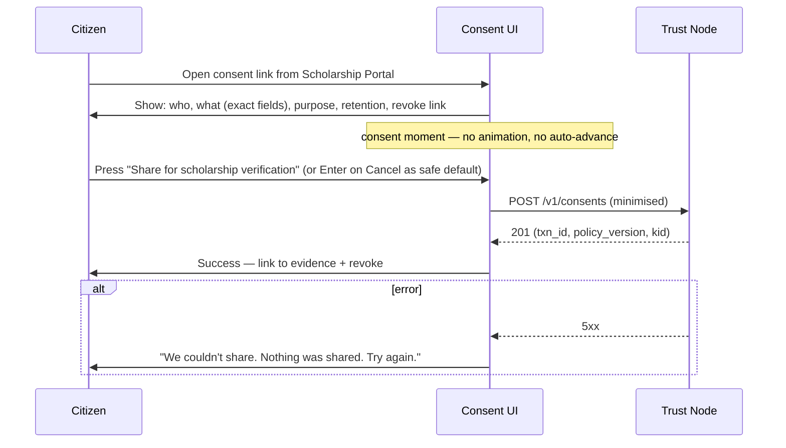

# P-22 — Example

## Filled invocation

```yaml
inputs:
  SURFACE: consent-ui
  JOB: "Citizen grants minimised consent for income-certificate sharing with the Scholarship Portal."
  USERS:
    - { segment: "urban Hindi-first", constraints: ["smartphone, 4G, used e-KYC before"] }
    - { segment: "rural Hindi-first", constraints: ["2GB Android, 3G, weak signal"] }
    - { segment: "low vision",         constraints: ["uses TalkBack"] }
  CONSTRAINTS: ["no real PII", "Hindi+English baseline", "<5s TTI on 3G", "<50KB CSS"]
  DPIA_REF: dpia/income-certificate-exchange.md
```

## Journey (excerpt — Mermaid)



## IA (excerpt)

| Screen | Entry | Exit | A11y |
|---|---|---|---|
| consent-grant--default | deep link from member | success / cancel | landmark `main`; focus on `btn-cancel` (safe default) |
| consent-grant--success | from default | back to member | live-region announces txn_id |
| consent-history        | wallet home | grant detail | keyboard-complete table |

## Wireframe (low-fi)

```
+----------------------------------------------------+
| BTX  Consent                              [ ? Help]|
+----------------------------------------------------+
| Share income certificate with Scholarship Portal?  |
|                                                    |
| Why: confirm you qualify for scholarship           |
| What is shared: yes/no over ₹2.5L threshold        |
| How long: 90 days, then deleted                    |
| You can revoke this any time.                      |
|                                                    |
| [ Share for scholarship verification ] [ Cancel ]  |
|                                          ↑ default |
+----------------------------------------------------+
```

## Wrong vs right

**Wrong** — "Share details" generic label
**Right** — exact fields visible: "yes/no over ₹2.5L threshold"

**Wrong** — auto-advance to success after 2 s of hover
**Right** — explicit press; no timer; Cancel is the keyboard default

## Executable acceptance

```bash
tools/journey-validate docs/design/surfaces/consent-ui/income-cert-share/journey.md      # exit 0
tools/ia-coverage      docs/design/surfaces/consent-ui/income-cert-share/                # exit 0
tools/consent-moment-check docs/design/surfaces/consent-ui/income-cert-share/            # exit 0
tools/research-brief-validate docs/design/surfaces/consent-ui/income-cert-share/research-brief.md  # exit 0
```

## Self-score template

```yaml
self_score: { prompt_id: P-22, overall: 9, blockers: [],
              evidence_refs: ["docs/design/surfaces/consent-ui/income-cert-share/journey.md",
                              "docs/design/surfaces/consent-ui/income-cert-share/ia.md"] }
```
