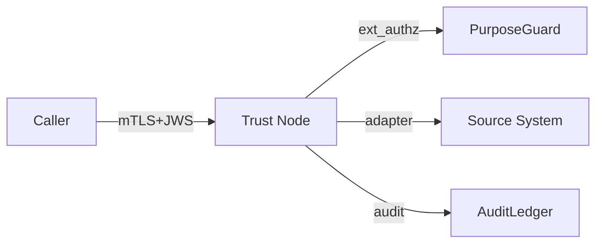

# Threat Model — `<service or surface>`

> STRIDE-based threat model. Required before any service goes to production. Save as `threat-models/<service>.md`.

| Field | Value |
|---|---|
| Subject | |
| Version | x.y |
| Owner | @… |
| Security reviewer | @security-lead |
| Status | draft \| approved \| superseded |
| Date approved | |

## 1. Description

What the service does, who calls it, what data it touches.

## 2. Architecture / Data Flow Diagram

Trust boundaries (number them):

1. Caller → Trust Node
2. Trust Node → PDP
3. Trust Node → Source System
4. Trust Node → AuditLedger

## 3. Assets

| Asset | Sensitivity | Owner |
|---|---|---|
| Member signing key | High | Member |
| Citizen context binding | High | BTX |
| Audit chain head | High | BTX Authority |
| Source records (via adapter) | Per class | Provider |

## 4. Threats (STRIDE)

| ID | Category | Threat | Attack path | Impact | Likelihood | Mitigation | Evidence | Residual |
|---|---|---|---|---|---|---|---|---|
| T-01 | S | Spoofed member | … | High | Low | mTLS + cert binding + bundle verify | CT-002 | Low |
| T-02 | T | Replay | … | Medium | Medium | Nonce + TTL + replay cache | CT-006 | Low |
| T-03 | R | Audit tampering | … | High | Low | Hash chain + anchor | CT-016 | Low |
| T-04 | I | Over-sharing | … | High | Medium | Provider minimisation | CT-013 | Low |
| T-05 | D | DoS | … | Medium | Medium | Ratelimit + circuit breaker | Load test | Low |
| T-06 | E | Insider misuse | … | High | Low | 4-eye + UEBA on audit | Anomaly test | Low |

Add categories as needed (STRIDE-LM, LINDDUN for privacy-sensitive flows).

## 5. Non-threats (out of scope)

- e.g. physical security of HSM data centre (separately handled)

## 6. Open issues

- [ ] …

## 7. Acceptance

- Residual risk acceptable to security lead: yes / no
- All "High" residual risks have a tracked mitigation plan
- All linked conformance tests pass on latest run
- DPIA (if applicable) approved

## 8. Sign-off

| Role | Name | Date | Signature |
|---|---|---|---|
| Service owner | | | |
| Security lead | | | |
| Privacy lead (if PII) | | | |

## 9. Review cadence

- Reviewed every release, or annually, whichever comes first.
- Triggered review on: new external integration, new data class, post-incident.
