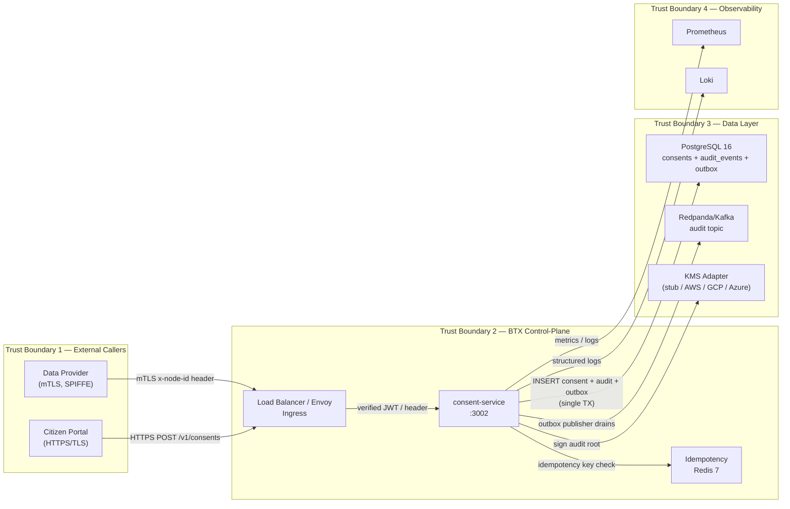

# Threat Model — consent-service (control-plane)

| Field | Value |
|---|---|
| Subject | `consent-service` (control-plane, port 3002) |
| Version | 1.0.0 |
| Date | 2026-05-17 |
| Author | @security-lead (agent-generated draft) |
| Status | draft — pending dual approval |
| Related DPIA | [dpia/consent-service.md](../dpia/consent-service.md) |
| Related ADRs | ADR-0021 (outbox), ADR-0022 (idempotency), ADR-0005 (audit) |

---

## 1. Scope and Boundaries

This threat model covers the `consent-service` running in the BTX control-plane. It processes consent lifecycle events (grant, revoke, query) for citizen personal data on behalf of data-sharing principals. It stores consent records, emits audit events to Kafka via outbox pattern, and exposes a Fastify HTTP API.

**Out-of-scope**: frontend/portal UI, downstream data providers, other trust nodes.

---

## 2. Data Flow Diagram (DFD)

Trust boundary numbers:
- **TB1**: Public internet / partner network
- **TB2**: Internal service mesh (SPIFFE/SPIRE, mTLS)
- **TB3**: Persistent data layer (private subnet)
- **TB4**: Observability plane (read-only export)

---

## 3. Asset Register

| Asset | Sensitivity | Location | Owner |
|---|---|---|---|
| `consents` table — consent records with citizen_id, principal_id, purposes | `citizen_portable` | PostgreSQL TB3 | data-steward |
| `audit_events` table — immutable change log | `restricted` | PostgreSQL TB3 (partitioned) | compliance-lead |
| `outbox` table — pending Kafka messages | `restricted` | PostgreSQL TB3 | sre-lead |
| Signing keys (DEK, audit root) | `non_shareable` | KMS TB3 | security-lead |
| Idempotency cache | `operational` | Redis TB2 | sre-lead |
| Kafka topic `btx.audit.events` | `restricted` | Redpanda TB3 | compliance-lead |
| mTLS leaf certificates (SVID) | `non_shareable` | SPIRE agent | security-lead |
| Service logs / metrics | `operational` | LOKI/Prom TB4 | sre-lead |

---

## 4. STRIDE Threat Table

> T01..T15 IDs from BTX Annex A §A.12.

| ID | Stride | Threat | Component | Severity | Likelihood | Risk | Mitigation | CT-ID | Residual |
|---|---|---|---|---|---|---|---|---|---|
| T01 | Spoofing | Forged `x-node-id` or JWT to impersonate a trust node | LB → CS | High | Medium | **High** | mTLS SVID required per ADR-0014; JWT verified with JWKS endpoint; SPIFFE SVID checked on every request | CT-005 | Low |
| T02 | Spoofing | Replay of captured consent grant request | LB | Medium | Low | **Low** | Idempotency-Key uniqueness enforced (ADR-0022); 24h TTL Redis cache; replay returns 200 + `x-idempotency-replayed` | CT-022 | Low |
| T03 | Tampering | SQL injection in consent query parameters | CS → PG | High | Low | **Medium** | Parameterised queries only (pg node driver); no raw string interpolation; input validated by JSON Schema on all routes | CT-010 | Low |
| T04 | Tampering | Modification of audit_events row post-insert | PG | High | Very Low | **Medium** | `audit_events` is INSERT-only (no UPDATE/DELETE path in code); DB role `audit_writer` has INSERT-only privilege; Merkle root chain detects tampering | CT-015 | Low |
| T05 | Tampering | Outbox message mutated before Kafka publish | PG → Kafka | Medium | Very Low | **Low** | Outbox ID is Kafka idempotency key; consumer verifies payload hash; WORM Kafka topic retention | CT-015 | Low |
| T06 | Repudiation | Actor denies granting or revoking consent | CS | High | Low | **High** | Every state transition appends an immutable audit event with actor identity, timestamp, request fingerprint; Merkle root committed daily (ADR-0021) | CT-015, CT-016 | Low |
| T07 | Repudiation | Agent claims no consent existed | CS | Medium | Low | **Medium** | Audit trail is externally verifiable via published Merkle roots; citizen portal shows provenance history | CT-015 | Low |
| T08 | Information Disclosure | Consent records returned to unauthorised caller | CS | High | Medium | **High** | `GET /v1/consents/:id` checks that caller principal_id matches consent's granting node or delegated reader; 403 on mismatch | CT-011 | Low |
| T09 | Information Disclosure | PII in logs (citizen_id, purpose string) | LOKI | Medium | Medium | **Medium** | Structured logging with PII fields redacted (citizen_id hash; purpose code only); log scrubber in Loki pipeline | CT-017 | Low |
| T10 | Information Disclosure | Outbox row leaks citizen data | PG | Medium | Low | **Low** | Outbox payload stores event reference ID + event type only; full payload in audit_events with access controls | CT-015 | Low |
| T11 | Denial of Service | Flood grant requests to exhaust DB connections | LB | High | Medium | **High** | Rate limiting at Envoy (500 req/s per IP); PgBouncer transaction-mode pool (ADR-0020); circuit breaker on pool exhaustion | CT-019 | Low |
| T12 | Denial of Service | Outbox publisher starvation blocks audit | CS | Medium | Low | **Medium** | OutboxPublisher is an isolated worker; backpressure limit; alert on outbox lag > 60s | CT-019 | Low |
| T13 | Elevation of Privilege | Compromised service account accesses other tables | PG | High | Low | **High** | Principle of least privilege: `consent_app` role has access to `consents`, `outbox`, `audit_events` only; no DDL rights; RLS enforced per tenant | CT-012 | Low |
| T14 | Elevation of Privilege | Pod escape from consent-service container | K8s | Medium | Very Low | **Low** | Non-root container, read-only root FS, seccomp profile, no NET_ADMIN or CAP_SYS_ADMIN | CT-020 | Low |
| T15 | Linkability (LINDDUN) | Correlation of citizen_id across multiple consent grants to build a profile | CS | High | Medium | **High** | Citizen ID hashed with a per-deployment salt before storage; cross-purpose consent linking forbidden by policy; PDP enforces data minimisation (ADR-0004, ADR-0007) | CT-018 | Medium* |

> *T15 residual risk is Medium due to inherent design tension in consent linkability for cross-purpose revocation cascade; mitigated by policy enforcement and audited access patterns. Tracked in mitigation plan below.

---

## 5. Mitigations Detail

| Mitigation | Description | Owner | Status |
|---|---|---|---|
| M-01 mTLS + SPIFFE SVID | All service-to-service calls use mTLS with SPIFFE SVIDs validated by SPIRE | @security-lead | Implemented (ADR-0014) |
| M-02 JWT validation | All inbound requests have JWT verified against JWKS endpoint; audience + issuer + expiry | @security-lead | Implemented |
| M-03 Parameterised queries | pg node driver parameterised queries throughout repository layer | @sre-lead | Implemented |
| M-04 Audit immutability | INSERT-only DB role; Merkle root chain; WORM Kafka retention | @compliance-lead | Implemented (ADR-0021) |
| M-05 Idempotency | Redis-backed idempotency key per (method, route, key); 24h TTL | @sre-lead | Implemented (ADR-0022) |
| M-06 Authorisation check | Principal ID cross-check on every GET consent; 403 on mismatch | @security-lead | Implemented |
| M-07 PII log scrubbing | Structured log fields: citizen_id → hash, purpose → code | @privacy-lead | Partial — needs Loki scrub pipeline config |
| M-08 Rate limiting | Envoy rate limit at 500 req/s per IP; PgBouncer pool limit | @sre-lead | Config in infrastructure |
| M-09 DB least privilege | `consent_app` DB role; no DDL; RLS per tenant | @sre-lead | Implemented |
| M-10 Container hardening | Non-root, read-only FS, seccomp/AppArmor, no capability escalation | @sre-lead | In Helm chart |
| M-11 Linkability mitigation | Citizen ID hashed with per-deployment salt; cross-purpose linking forbidden by PDP | @privacy-lead | Implemented in domain model |

---

## 6. Residual Risk Register

| Threat ID | Residual Risk | Risk Level | Mitigation Plan | Target Date | Owner |
|---|---|---|---|---|---|
| T15 | Linkability via consent query patterns | **Medium** | Deploy differential privacy noise layer on aggregate queries; add access pattern anomaly detection alert | 2026-Q3 | @privacy-lead |
| M-07 | PII field in debug logs if log level set to DEBUG in production | **Low** | Enforce `LOG_LEVEL=info` in production Helm values; add CI check | 2026-Q2 | @sre-lead |

---

## 7. Controls and Conformance Tests

| Control | CT-ID | Description |
|---|---|---|
| Authentication | CT-005 | SPIFFE SVID + JWT verify on all routes |
| Authorisation | CT-011 | Principal ID cross-check enforced |
| Least Privilege | CT-012 | DB role permissions validated |
| Audit Immutability | CT-015 | INSERT-only audit; Merkle root chain |
| Audit Consistency | CT-016 | Merkle root published on schedule |
| Log PII | CT-017 | PII fields not present in log output |
| DPIA Gate | CT-018 | DPIA approved before production promotion |
| Rate Limiting | CT-019 | Rate limit headers present; 429 on breach |
| Pod Security | CT-020 | Non-root container, seccomp applied |
| Idempotency | CT-022 | Idempotency-Key replay returns 200 + header |

---

## 8. Open Items / Policy Deltas

1. **Loki scrub pipeline** (M-07): Add PII scrub transform in Loki pipeline config. No Rego change required.
2. **Differential privacy** (T15): Future ADR required when aggregate query endpoint is added. Reference P-04 for Rego obligation update.

---

## 9. Sign-off

| Role | Name | Date | Signature |
|---|---|---|---|
| Security Lead | _pending review_ | — | — |
| Privacy Lead | _pending review_ | — | — |
| Data Steward | _pending review_ | — | — |

> Artefact is agent-generated draft. Requires dual approval from `@security-lead` and `@privacy-lead` before production gate.
